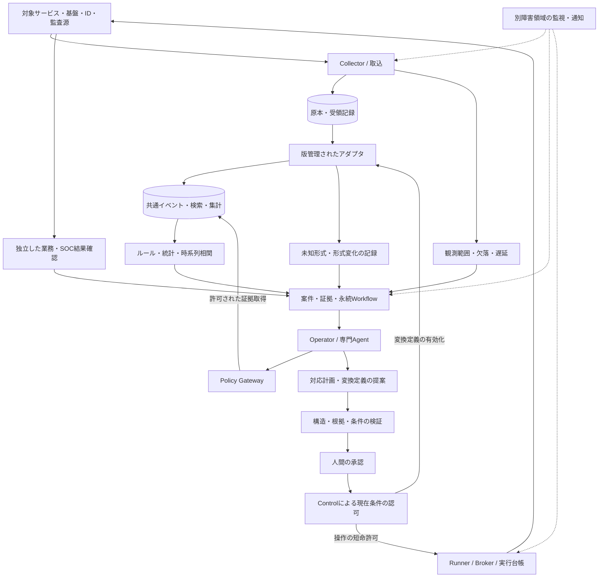

# OpSyne — 設計思想とアーキテクチャ

この文書は、OpSyneの設計思想、構成要素、責任分担、データと権限の流れを単独で読める形に整理したものです。利用者から提供された観測アーキテクチャと、その後の半自律運用・SOC、未知ログ共通化の議論を基礎とします。ハッカソン用の模擬構成を前提にしません。

ここに示すのは採用する設計であり、すべてが現在の製品に実装・検証済みという意味ではありません。実装手順、開発工程、テスト結果、進捗は扱いません。

## 1. プロダクトが目指すもの

OpSyneは、複数のサービスについて、観測、異常の発見、原因調査、対応案の作成、人間による承認、操作、結果確認、記録を一つの流れで扱う運用基盤です。可用性や性能を扱う運用と、侵害の疑いを扱うSOCを、共通の証拠・案件基盤で連携させます。

通常の調査と準備はシステムが進め、人間は根拠・影響・復旧条件を確認して計画を承認する、という利用体験を目指します。導入時の対象登録、観測源、権限、業務上の成功条件の設定は必要です。観測不足、権限不足、意味不明な業務処理などで判断できない場合には、不足を明示して人間へ引き継ぎます。

汎用性は、サービス固有の意味を消すことではなく、共通の運用手順にサービス固有の接続・意味・操作・確認方法を組み込めることで実現します。どのサービスでも例外なく承認だけで運用できる、という保証は置きません。

## 2. 設計の中心原則

**観測と候補抽出は通常のプログラム、解釈と提案はLLM、認可と実行制御は決定論的なプログラムが担当します。**

| 原則 | 設計上の意味 |
|---|---|
| LLMを権限の根拠にしない | モデルの確信や「承認済み」という文章から実行許可を作らない |
| 全量観測とLLM入力を分ける | 収集対象の全件を保存・解析対象にし、LLMには調査に必要な証拠を段階的に渡す |
| 未知を正常にしない | 未対応形式、解析失敗、観測欠落、結果不明を独立した状態として残す |
| 原本と解釈を分ける | 共通化・集計・要約の後も原本との対応を維持し、解釈を再生成できるようにする |
| 観測と操作を分ける | ログを読める権限からサービスを変更する権限を導かない |
| 提案・承認・実行を分ける | 提案者が自分の提案を認可せず、実行直前にも条件を照合する |
| 実行と結果確認を分ける | 操作APIの成功応答だけで業務復旧や侵害根絶と判定しない |
| 停止しても状態を失わない | 案件、処理待ち、承認、操作の意図、結果不明を永続化する |

## 3. 全体アーキテクチャ

図の箱は論理的な責任境界です。Agentの役割ごとに常駐モデルや専用コンテナを必須とはしません。一方で、資格情報、ネットワーク、保存領域、実行主体の分離は、同じホストに配置するときも維持します。

Controlは対象・設定・案件・認可の正本を管理します。AgentはControlが発行する有限のtaskを実行します。Runner/Brokerはモデルの文章ではなく、認可された型付き操作を受け取ります。

## 4. 観測と異常発見

### 4.1 「全ログを見る」の意味

対象ごとに必要な観測源を登録し、アプリケーションログ、認証・権限・管理操作の監査、基盤状態、メトリクス、トレース、業務上の確認結果などを収集します。全件を処理対象にする範囲は、この登録された観測源と取得可能な期間です。記録されない操作や権限上取得できない情報まで見えているとは扱いません。

収集後に単純な重大度だけでログを捨てません。原本を保持し、既知の検知、時系列相関、未知形式の発見、定期的な探索の対象にします。LLMに全件を逐次送信する方式にはせず、全件の機械処理と必要な詳細への再検索を組み合わせます。

### 4.2 観測の完全性も監視する

受信できたこと、欠落なく収集できたこと、解析できたこと、サービスが正常なことは別の状態です。観測源ごとに最終受信、処理遅延、取得位置、欠落区間、解析失敗、保持範囲を管理します。情報がないときはゼロ件や正常に置き換えません。

CollectorはRunnerやLLMから独立して継続します。取得位置と送信待ちを永続化し、受領の確定後に送信待ちを解消します。再送で同じイベントを二重に案件化しないよう、イベントの識別と重複排除を行います。

### 4.3 複数の経路から案件を作る

既知のルール、頻度・分布・通常状態からの変化、複数観測源の時系列相関、業務確認の失敗、観測源の停止、未知形式の増加を、それぞれ調査の入口にします。閾値に該当した案件だけでなく、定期探索でも未分類の証拠や傾向を確認します。

検知は「調べる理由」を作る処理です。アラートだけで侵害を確定せず、アラートがないだけで安全とも判定しません。

## 5. 未知ログを共通化する仕組み

### 5.1 部分的な理解から始める

共通イベントには、時刻、対象、観測源、原本参照に加え、解釈できる範囲でカテゴリ、操作、結果、主体、対象物、重大度、通信情報を持たせます。ログにない情報は補完して事実化しません。元ログが主張する重大度と、OpSyneが評価する案件のリスクも区別します。

構文を読めることと意味が分かることは別です。例えばJSONとして読めても、独自の結果コードの意味が未定義なら、結果は未知のまま残します。

### 5.2 LLMは未知の形式の変換案を作る

1. 承認済みアダプタで扱えない入力を、対象・形式・構造・イベント種別に基づいてまとめます。
2. Adapter Agentに、マスク済みの実例と出自、解釈できていない項目を渡します。
3. Agentは共通項目への対応、適用条件、根拠、不明点を提案します。意味を確定できなければ提案を保留します。
4. 通常のプログラムが、定義の構造、適用範囲、標本との対応、不正入力の拒否、既存定義との競合を検査します。
5. 人間が意味と適用条件を確認して、特定の版を承認します。
6. 以後の同種ログは、その定義を通常のプログラムで処理します。

つまり、新しい形式や意味の変化をLLMが調べ、学習した変換を版管理して再利用します。同じ形式のログが出るたびにLLMへ判断を依頼する必要はありません。

### 5.3 変換定義も信頼境界を持つ

変換案は限定された宣言的な定義とし、任意コード、SQL、外部通信、権限変更を含めません。定義は対象の実体・エンジン・版に結び付け、承認後の内容変更や対象の置換を無条件に受け入れません。

適用条件外、未対応値、型の変化、複数の定義への一致は未知として残します。機械検証の成功は、業務的な意味の正しさの証明ではありません。変換定義の承認は、サービス操作の承認にもなりません。

原本を変更せず、使用した定義と版を持つ派生結果を保存します。定義変更・失効後には、現在有効な解釈だけを採用します。保存済みログの再解析と、新規ログの検知を分け、再解析が本番操作の再実行につながらないようにします。

## 6. Agentの責任分担

Operator、SRE、Securityを運用の中心とし、共通化・開発・レビュー・検証・定期探索を別の役割として扱います。役割の数を増やすこと自体を品質保証にはしません。

| 役割 | 担当する判断 | 担当しないこと |
|---|---|---|
| Operator | 全体状態、案件の優先度、調査の委譲、結果の統合、人への説明 | 自分で承認・権限発行すること |
| SRE | 可用性、性能、容量、依存、業務不整合の調査と復旧案 | API成功だけで復旧を確定すること |
| Security / SOC | 不審な認証・変更・アクセスの調査、影響範囲、封じ込め・根絶・復旧案 | 観測不足を侵害なしと判断すること |
| Adapter | 未知ログの意味の調査、共通化定義と根拠の提案 | 自分の変換を有効化したり操作権限を得ること |
| Development | 再現、隔離環境でのコード修正、試験、Issue・PRへの成果物整理 | 本番資格情報の取得、無承認のmerge・配備 |
| Change Review | 対応計画・差分・試験根拠の評価、欠陥や不足の指摘 | レビューの賛成を実行認可にすること |
| Verification | 独立した証拠の評価、到達状態と残留リスクの整理 | 実行者の自己申告だけで解決すること |
| Periodic | 長期傾向、再発、未対応領域、改善候補の探索 | 通常状態、抑制、Policyを自己更新すること |

Operatorには全体の集計、案件、観測範囲、滞留、変更履歴を渡します。全ログの原文や秘密への無制限なアクセスは与えません。専門Agentは案件に必要な証拠を取得し、必要なら許可範囲内で追加検索します。

Agentの出力は事実、仮説、不明点、根拠参照、提案を分けます。モデルの会話履歴を案件・認可・実行状態の正本にはしません。

## 7. Policy Gatewayと最小権限

Gatewayは、モデルへの指示ではなく、Tool呼び出しを実際に制限する境界です。利用できる権限は、役割に許された範囲、案件の対象範囲、所有者の設定、現在のPolicyの共通部分とします。Agent間の委譲で権限を増やしません。

呼び出しごとに主体、役割、task、対象、操作、引数、データ分類、期間、件数、送信先、期限、費用、設定の版を照合します。必要な条件を確認できなければ拒否します。許可範囲外の追加調査は不足として提示し、Agent自身が許可を書き換えることはできません。

Agentには本番の秘密、署名鍵、Docker socket、Control DBへの直接接続、任意shell・SQL・URLの実行経路を渡しません。Collector、モデル送信、開発、実行、通知は資格情報を分離し、ネットワークと接続先側の権限でも制限します。

ログ、Issue、コード、他Agentの出力は非信頼データです。本文に書かれた命令や「管理者が承認した」という記述は、Toolの利用許可に影響しません。広い下流権限を必要とするBrokerは、その権限を持つ信頼境界として明示します。

## 8. 計画・承認・実行・結果確認

対応計画には対象、操作、実行順序、根拠、事前条件、影響、成功条件、中止条件、戻せる条件を含めます。複数の操作は依存関係のある工程として扱い、補償操作にも許可を必要とします。

人間は内容が固定された計画を承認します。承認は計画と対象の版に結び付け、内容の変更後も古い承認を流用しません。実行時にはControlが現在のPolicy、対象実体、期限、競合、事前条件を再確認し、限定された実行許可を発行します。

Runner/Brokerは外部操作の前に実行の意図を耐久台帳へ記録します。タイムアウトなどで結果が分からない場合はUNKNOWNとし、同じ操作を無条件に再送しません。対象の実状態と操作履歴を照合してから次へ進みます。

結果確認は独立した観測と、対象ごとの業務上の成功条件で行います。プロセスが動いたこと、HTTPが応答したこと、データの読書きや業務機能が回復したこと、侵害の影響が除去されたことを分けて記録します。

## 9. サービスへの接続と開発連携

サービス固有の情報は、次の契約に分けます。

| 契約 | 保持する内容 |
|---|---|
| サービス | 実体、所有者、依存関係、業務機能、重要度 |
| 観測源 | 取得方法、必要権限、形式、遅延・欠落・保持の限界 |
| 変換 | 原本から共通イベントへの対応、適用条件、版、根拠 |
| 操作能力 | 実行できる型付き操作、引数、対象制約、影響、冪等性 |
| 結果確認 | 業務・運用・SOCそれぞれの確認方法と成功条件 |

共通基盤は案件、証拠、認可、実行台帳を扱い、Connectorは接続先の固有APIや制約を扱います。新しいサービスへの接続は、これらの契約を追加する形で拡張します。

コード修正が必要な場合は、案件の証拠からIssue、再現、隔離環境での修正、PR、独立したCI、承認、配備、結果確認へつなぎます。開発Agentの試験結果だけで本番変更を許可せず、成果物の版とdigestを計画に結び付けます。

## 10. 永続化と障害への備え

保存対象は、原本、共通イベント、検索用データ、対象・依存関係、案件、Agent task、変換定義、承認、実行台帳、観測状態、監査です。原本と認可・実行の正本を、再生成できる検索結果や要約から区別します。

取込、検知、Agent、実行、結果確認、通知、再解析に別の処理待ちと処理上限を設けます。LLM停止や費用上限で収集を止めず、再解析の負荷で新規観測を圧迫しないようにします。

Runner停止は独立Collectorで、Collector停止は観測範囲の劣化として、Controlやホスト全体の停止は別障害領域の監視で検出します。同じPC上のWatchdogだけでは、そのPC自体の停止を通知できません。

復元ではDBだけでなく、実行台帳、送信待ち、取得位置、鍵、認可の世代を照合します。復元前の操作が消えた状態で再実行されないことを優先します。監査には根拠参照、定義・計画の版、認可理由、承認主体、実行と検証の結果を残します。

## 設計の参照元

- 利用者提供「OpSyne 観測・異常検知・マルチエージェント運用設計」：観測・機械検知とLLM調査の分離、Operator/SRE/SOC、未知を正常にしない原則。
- [半自律運用・SOCの仕様セット](design-source.md#参照資料の範囲)：責任分離、全量観測、Gateway、計画、認可、実行、検証、接続契約。
- 利用者との追加設計：未知ログをLLMで解釈し、検証・承認した変換定義を再利用する経路。
